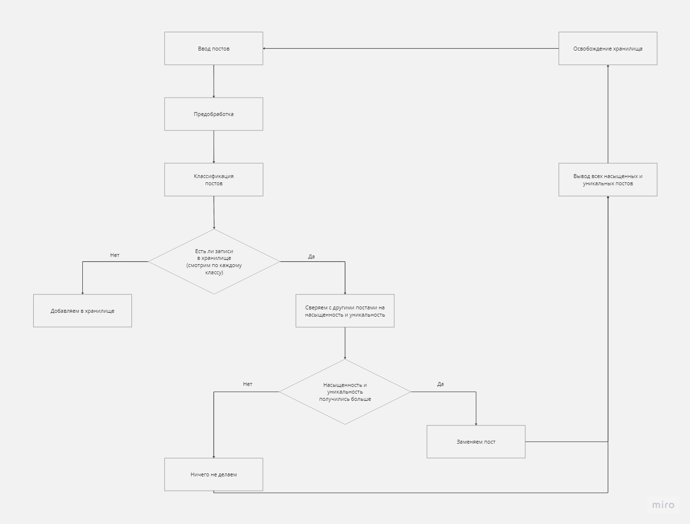
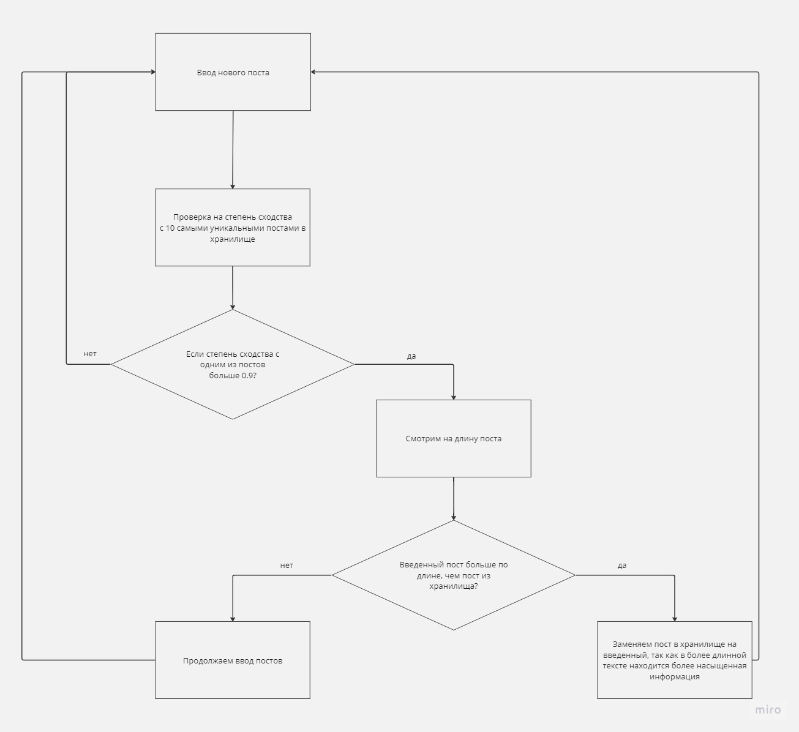

# ai_news
ИИ-микросервис, который будет удалять дубликаты новостей
из фиксированного набора и классифицировать новости по заранее
известным категориям. В случае идентичной тематики в дублях
будет выбираться та, которая более насыщена целевой информацией.

# Pipeline

# Обновление хранилища

# Слова организатора
Вам на вход дадут датасет статей, и мы должны сделать вывод как в тг боте.

